# Cloudera Blueprint: CDP Agent Gateway

**Agent governance** for [Cloudera Data Platform](https://www.cloudera.com/). Third-party agents present [Apache Knox](https://knox.apache.org/) JWTs at a north-south gateway. They never talk to Livy, HiveServer2, Impala, Ozone, or NiFi hostnames. Ranger stays authorization. Catalog fields live in [`METADATA.yaml`](METADATA.yaml).

This repo follows the [Cloudera Blueprints Standard](https://github.com/kevinbtalbert/Cloudera-Blueprints-Standard). After reading this page you should know what the blueprint does, who it is for, and how to run the local demo.

## Table of Contents

- [Overview](#overview)
- [Demo](#demo)
- [Use Case](#use-case)
- [How this compares to AI gateways](#how-this-compares-to-ai-gateways)
- [Key Features](#key-features)
- [Quickstart](#quickstart)
- [Software Components](#software-components)
- [Target Audience](#target-audience)
- [Repository Structure](#repository-structure)
- [Prerequisites](#prerequisites)
- [Hardware Requirements](#hardware-requirements)
- [Documentation](#documentation)
- [License](#license)

## Overview

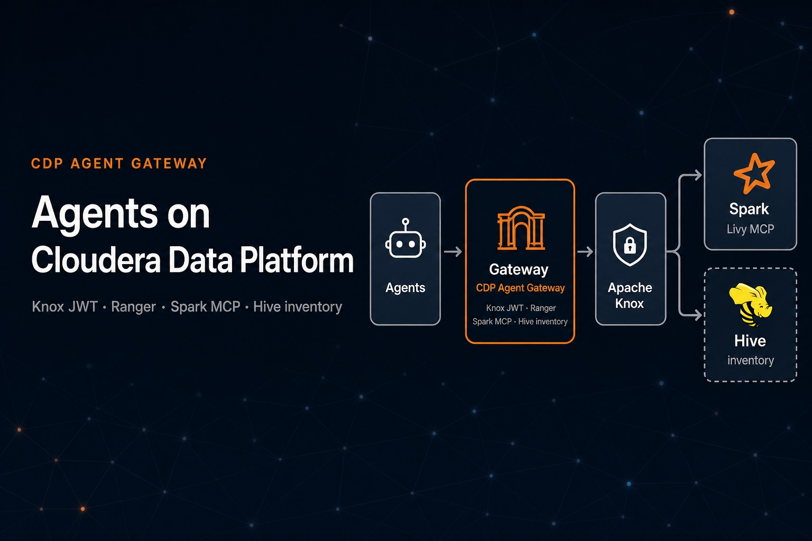

CDP Agent Gateway is **agent governance** for Cloudera Data Platform. Cursor, Claude, and other MCP hosts can run Spark, Hive, and Impala without learning cluster topology and without a parallel credential path. Apache APISIX terminates agent HTTP, validates Knox-issued RS256 JWTs, and forwards the same bearer into Knox `cdp-proxy-token` **Livy for Spark 3**. Agents use MCP at `/mcp/spark`. Operators can `GET` Livy for tests and stage job files with **WebHDFS** (`/cdp/webhdfs*`). Knox Trusted Proxy and Apache Ranger remain the authorization source of truth. Operator quotas, burst caps, and audit join record which agent product and which Knox user called which tool.

Hive is inventoried (`gateway jdbc add`) and agents use read-only MCP at `/mcp/hive`. Impala uses read-only MCP at `/mcp/impala`. `/cdp/hive` and `/cdp/impala` are not agent routes. Ozone and NiFi stay unpublished. Cloudera value is unchanged identity and data policy: agents do not get a parallel credential path into the lakehouse.

## Demo

A recorded Reprise walkthrough is not published yet. The current path is the local Docker stack in [Quickstart](#quickstart): mock Knox, APISIX on `localhost:9080`, Spark MCP at `/mcp/spark`, read-only Hive MCP at `/mcp/hive`, read-only Impala MCP at `/mcp/impala`, operator admin UI on `127.0.0.1:9090`. Pytest covers missing bearer, `alg=none`, expired tokens, subject forwarding, and MCP tool list. `--mint` is the lab JWT only; live Knox uses `gateway token set`.

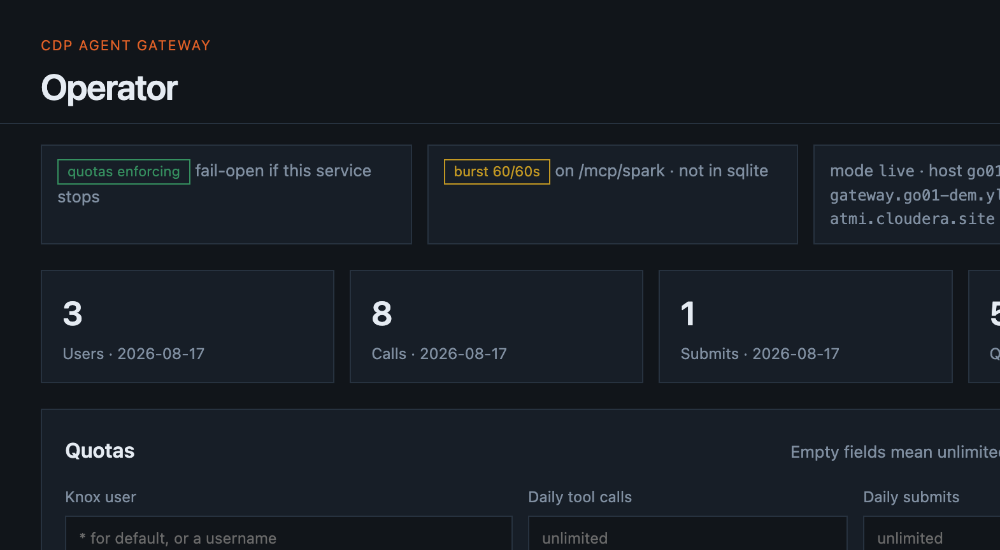

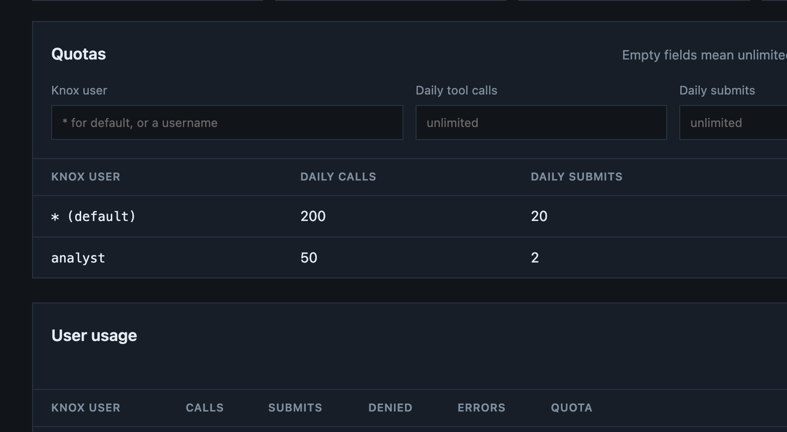

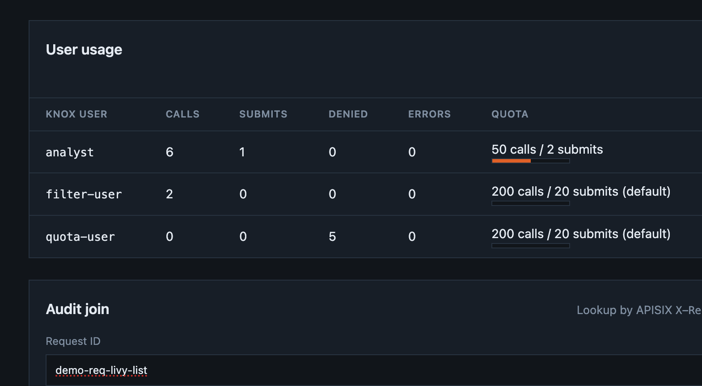

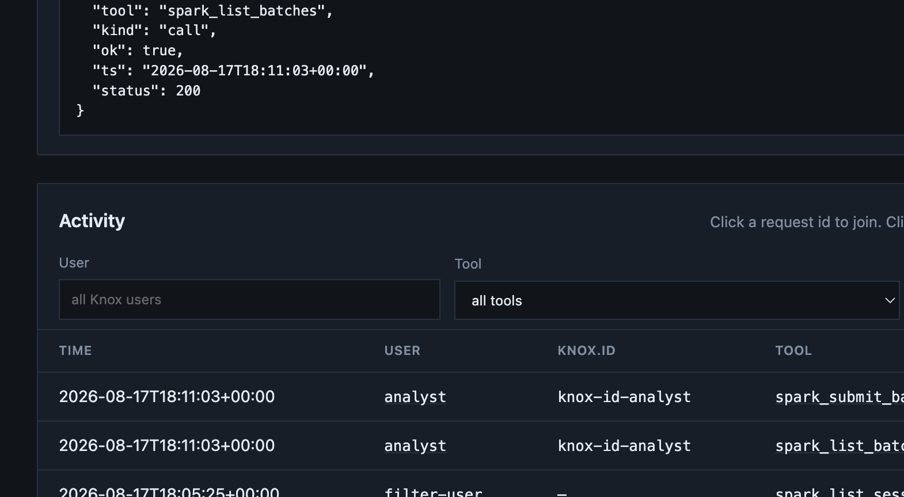

The admin console is for operators, not MCP hosts. Full walkthrough: [docs/admin.md](docs/admin.md).

Third-party agents are demonstrated with the Jupyter notebooks in [`examples/agent/`](examples/agent/README.md), not the operator CLI. [`third_party_agent.ipynb`](examples/agent/third_party_agent.ipynb) is a scripted MCP host (the same POST JSON-RPC a Cursor or Claude host would send). [`langgraph_agent.ipynb`](examples/agent/langgraph_agent.ipynb) shows **LangGraph**: a ReAct agent bound to the same Spark, Hive, and Impala tools. Both present a Knox JWT and never call cluster APIs directly.

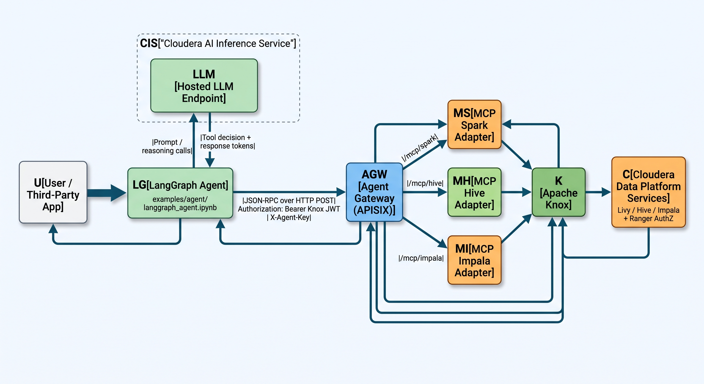

### LangGraph request sequence

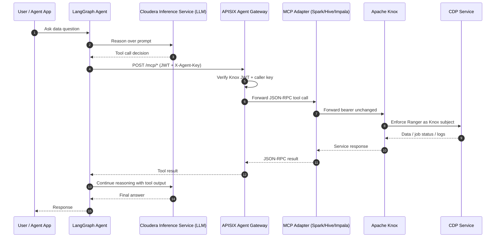

### Identity and trust boundaries

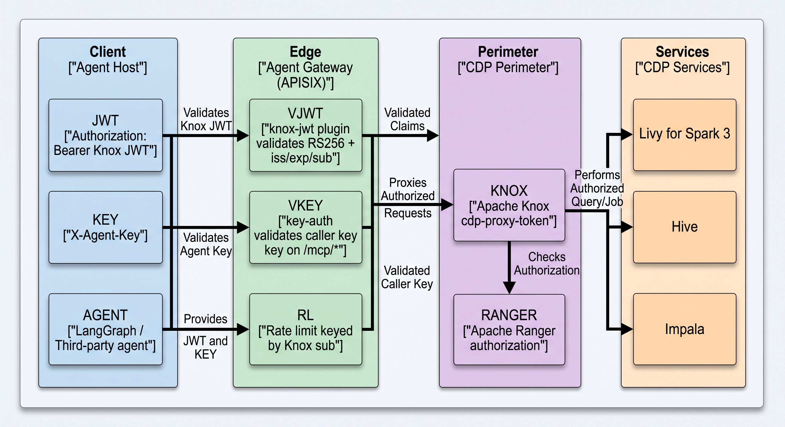

### Exposed and blocked routes

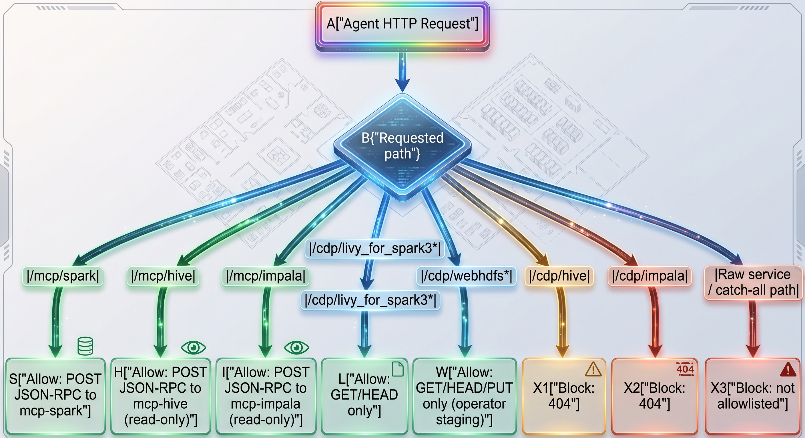

On a live cluster that notebook path is what produces the Spark History, Data Catalog, and operator activity evidence below: `spark_submit_batch` writes `{user}.count_to_10` as the Knox subject, then Hive MCP selects it.

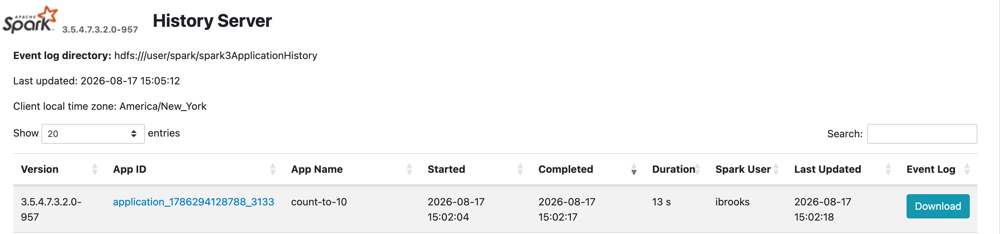

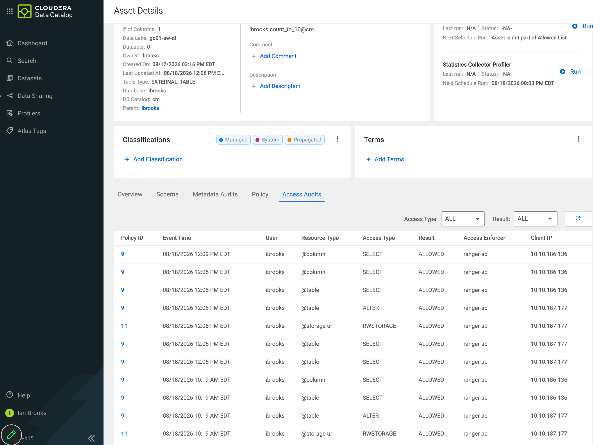

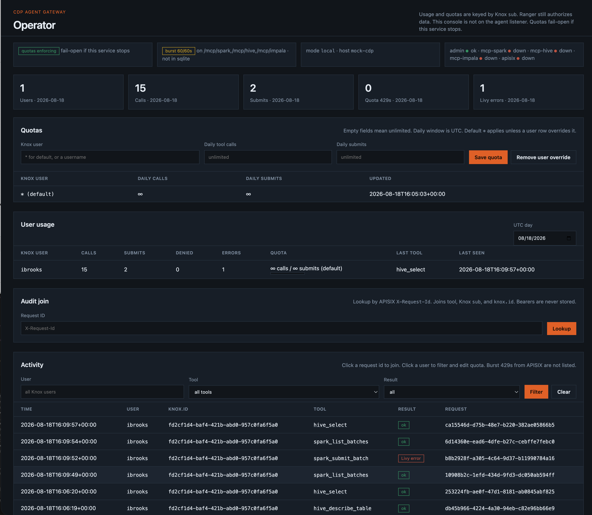

## Use Case

Enterprises need to **govern** coding and analytics agents that submit Spark jobs and query Hive or Impala on CDP. They cannot publish Livy, HiveServer2, or Impala to those tools, and they cannot mint a second identity plane. This blueprint gives one agent-facing address that allowlists Spark MCP plus read-only Hive and Impala MCP, binds each call to a Knox user, keeps Ranger in charge of data access, and gives operators quotas plus audit join — without replacing the CDP perimeter.

## How this compares to AI gateways

This is a **CDP agent gateway**, not an **AI gateway**. Products in the AI-gateway class — [Envoy AI Gateway](https://github.com/envoyproxy/ai-gateway), Kong AI Gateway, LiteLLM-style proxies, and similar — sit in front of **models**. They unify OpenAI-shaped APIs, inject provider keys, meter tokens, and fail over across OpenAI, Bedrock, Anthropic, and self-hosted inference. Some also **multiplex** other people's MCP servers.

This blueprint sits in front of **Cloudera Data Platform** as an **agent governance** edge. Agents present a Knox JWT. MCP adapters **implement** Spark, Hive, and Impala tools and forward the same bearer. Knox stays the CDP perimeter. Ranger still authorizes the token `sub`. There is no LLM translation, no token spend cap, and no catch-all MCP multiplexer.

They compose; they do not replace each other. A coding agent that reasons with an LLM and writes Iceberg via Livy wants an AI gateway on the model hop and this gateway on the lakehouse hop. Do not put Knox JWTs on the model path or provider API keys on Livy.

| | This blueprint | AI gateways (e.g. Envoy AI Gateway) |
| --- | --- | --- |
| Job | Agent governance: agents → CDP (Spark / Hive / Impala) | Apps → GenAI providers and self-hosted models |
| Identity | Knox RS256 JWT (`sub`, `knox.id`); Compose `X-Agent-Key` names the agent product | OAuth/OIDC to clients; API keys injected toward providers |
| Authorization | Apache Ranger on the Knox subject | Gateway policy (token quotas, tool filters, CEL) |
| MCP | Three adapters that **are** the tools (`/mcp/spark`, `/mcp/hive`, `/mcp/impala`); POST JSON-RPC | Multiplex N upstream MCP servers; often Streamable HTTP |
| Rate limit | HTTP burst per Knox `sub` plus operator daily quotas | LLM tokens (input / output / cached / reasoning) |
| Audit | Operator join of tool, Knox `sub`, `knox.id`, and `X-Request-Id` | Provider usage logs toward models |
| Must not | Replace Knox, proxy raw Hive/Impala, mint a second user JWT | Validate Knox, honor Ranger, submit Livy batches |

Architecture constraints: [docs/architecture.md](docs/architecture.md). Identity: [docs/identity-and-auth.md](docs/identity-and-auth.md).

## Key Features

- Agent governance — Knox identity, Ranger authorization, MCP allowlists, per-user quotas, and audit join
- Knox JWT at the agent edge — no second token format, no APISIX-minted user credentials
- Dual identity — Compose MCP `X-Agent-Key` names the agent product; Knox JWT `sub` / `knox.id` is the CDP user. AMP is JWT-only (CML project is the agent).
- RFC 9728 PRM — `GET /.well-known/oauth-protected-resource`; `401 WWW-Authenticate` includes `resource_metadata`
- Spark allowlist — MCP `/mcp/spark` (list, get, log, submit); Livy HTTP is GET/HEAD only; WebHDFS GET/HEAD/PUT for operator file staging
- Hive MCP — `/mcp/hive` list/describe/select (no `SELECT *`, limit 50); `/cdp/hive` stays 404
- Impala MCP — `/mcp/impala` list/describe/select (no `SELECT *`, limit 50); `/cdp/impala` stays 404
- JDBC inventory — `gateway jdbc add` stores Knox Hive JDBC and/or CDW Impala JDBC; `gateway hive` / `gateway impala` list databases
- Local-to-live — `gateway knox <livy-url>` points the same Compose file at external Knox
- Operator admin UI — UTC-day usage, quotas vs burst 429s, audit join on localhost `:9090`
- MCP burst cap — `limit-count` on `/mcp/spark`, `/mcp/hive`, and `/mcp/impala` keyed by Knox `sub` (default 60/minute)
- Ranger stays authoritative — the gateway does not impersonate a different user than the token subject
- Third-party agent notebooks — [`examples/agent/`](examples/agent/README.md) demos an MCP host (`third_party_agent.ipynb`) and a **LangGraph** ReAct agent (`langgraph_agent.ipynb`) against `/mcp/spark`, `/mcp/hive`, and `/mcp/impala`

## Quickstart

1. Clone the repository.
2. Install Docker and Python 3.11+ (`make` is optional).
3. Create a virtualenv and install the CLI:

   ```bash
   python3 -m venv .venv
   source .venv/bin/activate
   pip install -e ".[dev]"
   ```

4. Start the local stack and run tests:

   ```bash
   cp .env.example .env
   gateway init
   gateway up
   gateway test
   ```

   `gateway` is the operator CLI (`python -m agentgateway` also works). `gateway test` overlays mock-cdp without rewriting a live `.env`, starts Compose, runs pytest (excluding live CDP), then restores APISIX yaml from `.env`. Commands: [docs/operator-cli.md](docs/operator-cli.md).

5. Optional — point the same gateway at a live cluster:

   ```bash
   gateway knox https://knox.example.com/env/cdp-proxy-token/livy_for_spark3/
   gateway jdbc add 'jdbc:impala://coordinator.example:443/default;AuthMech=12;transportMode=http;httpPath=cliservice;ssl=1;auth=browser'
   gateway fetch-jwks --insecure
   gateway token set
   gateway up
   gateway spark
   gateway webhdfs ls /
   gateway mcp
   gateway hive              # SHOW DATABASES; needs pip install -e ".[hive]"
   gateway mcp --adapter hive --tool hive_list_databases
   gateway mcp --adapter impala --tool impala_list_databases
   gateway admin --open      # http://127.0.0.1:9090
   ```

   `gateway knox` writes host, port, `cdp-proxy-token` prefix, and JWKS URL into `.env`. Spark: [docs/spark.md](docs/spark.md). Hive: [docs/hive.md](docs/hive.md). Impala: [docs/impala.md](docs/impala.md). Do not commit `.env`.

6. Optional — demonstrate third-party agents with the notebooks in [`examples/agent/`](examples/agent/README.md). [`third_party_agent.ipynb`](examples/agent/third_party_agent.ipynb) is a scripted MCP host; [`langgraph_agent.ipynb`](examples/agent/langgraph_agent.ipynb) shows **LangGraph** ReAct over the same tools. Paste a Knox JWT in the notebook (`getpass`); do not put it in git or AMP project env. LangGraph locally: `pip install -e ".[langgraph]"`.

7. Optional — Cloudera AI Workbench AMP (not Docker Compose). Live Knox only; `launchable` stays false until a workbench proof. How-to: [docs/amp.md](docs/amp.md).

Do not commit Knox tokens, JDBC passwords, or private keys.

## Architecture / Software Components

Agents terminate at APISIX (Compose) or at a Cloudera AI Application (optional AMP). That edge is the **agent governance** hop: Knox JWT, caller key, allowlisted MCP, quotas, and audit. The `mcp-spark`, `mcp-hive`, and `mcp-impala` adapters sit behind it and forward the caller's Knox bearer to Livy, Hive, or Impala. Knox remains the only hop that presents cluster credentials. The admin UI is not an agent route (localhost `:9090` on Compose; CML login on AMP).

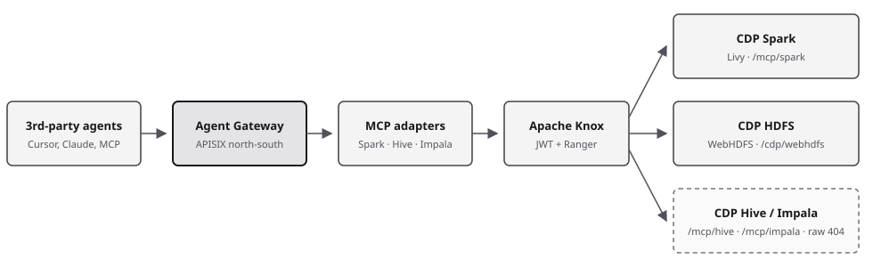

Spark MCP is the published Spark path. Operators stage HDFS files at `/cdp/webhdfs*`. Hive MCP is read-only at `/mcp/hive`. Impala MCP is read-only at `/mcp/impala`. `/cdp/hive` and `/cdp/impala` stay **404**. JDBC inventory is `gateway jdbc add` / `gateway hive` / `gateway impala`.

| Component | Role |
| --- | --- |
| Apache APISIX | Agent-facing HTTP edge (Compose): Knox JWT plugin, RFC 9728 PRM, MCP caller keys, allowlisted routes, request IDs |
| Python `knox-jwt` | Same RS256 / `iss` / `exp` / `sub` checks for the optional CML AMP profile |
| `knox-jwt` plugin | RS256, `iss=KNOXSSO`, expiry; pinned PEM; forwards `Authorization` |
| `mcp-spark` | Livy MCP tools (list/get/log/submit); not an APISIX plugin |
| `mcp-hive` | Hive MCP tools (list/describe/select); not an APISIX plugin |
| `mcp-impala` | Impala MCP tools (list/describe/select); not an APISIX plugin |
| Mock CDP (lab) | Stand-in Knox JWKS and Livy probes for `gateway test` |
| Operator admin | Local UI on `:9090`: UTC-day usage, quotas vs burst 429s, audit join |
| Apache Knox | Token issuance, `cdp-proxy-token`, Trusted Proxy / doAs |
| Apache Ranger | Authorization for the Knox subject on Spark, Hive, Impala, and HDFS |

| Agent URI | Methods | Upstream |
| --- | --- | --- |
| `/mcp/spark` | POST JSON-RPC | `mcp-spark` → Knox Livy |
| `/mcp/hive` | POST JSON-RPC | `mcp-hive` → Knox Hive (read-only) |
| `/mcp/impala` | POST JSON-RPC | `mcp-impala` → CDW `cliservice` or Knox Impala (read-only) |
| `/cdp/livy_for_spark3*` | GET, HEAD | Knox Livy (operators/tests) |
| `/cdp/webhdfs*` | GET, HEAD, PUT | Knox WebHDFS (operator staging) |
| `/cdp/hive` | — | **404** (not published) |
| `/cdp/impala` | — | **404** (not published) |

Extended design: [docs/architecture.md](docs/architecture.md), [docs/amp.md](docs/amp.md), [docs/spark.md](docs/spark.md), [docs/hive.md](docs/hive.md), [docs/impala.md](docs/impala.md), [docs/admin.md](docs/admin.md), [docs/identity-and-auth.md](docs/identity-and-auth.md).

## Target Audience

- Platform and security architects who need **agent governance** on CDP without a second identity plane
- Data engineers and SEs running a laptop lab against mock Knox or a VPN-connected cluster
- Partner / ISV teams onboarding MCP hosts (Cursor, Claude) behind Knox
- Cloudera AI Workbench operators who want an optional AMP profile against live Knox

## Repository Structure

| Path | Description |
| --- | --- |
| `assets/` | Architecture diagram, AMP catalog cover, admin UI, Spark History, and Data Catalog screenshots |
| `deploy/` | Docker Compose (APISIX, mock CDP, mcp-spark, mcp-hive, mcp-impala, admin) |
| `docs/` | Architecture, Spark, Hive, Impala, admin, identity, AMP, phases, tests |
| `LICENSE` | Apache License 2.0 |
| `METADATA.yaml` | Catalog metadata for the Cloudera blueprint website |
| `.project-metadata.yaml` | Optional CML AMP runbook (`launchable` is still false) |
| `0_`–`7_` AMP dirs | CML jobs/apps; ignored by Compose |
| `conf/` | APISIX standalone config templates |
| `plugins/` | Custom `knox-jwt` APISIX plugin |
| `inventory/` | Phase 0 CDP inventory consumed by tests |
| `src/agentgateway/` | Operator CLI (`gateway` / `python -m agentgateway`) |
| `mcp-spark/` | Livy Spark 3 MCP adapter |
| `mcp-hive/` | Hive MCP adapter (read-only) |
| `mcp-impala/` | Impala MCP adapter (read-only) |
| `admin/` | Operator usage/quota UI (`127.0.0.1:9090`) |
| `examples/spark/` | Sample Spark 3 batch (`count_to_10.py`) that writes Iceberg for Hive |
| `examples/hive/` | Query that table with Hive MCP (`hive_list_tables` / `hive_describe_table` / `hive_select`) |
| `examples/impala/` | Same Iceberg table through Impala MCP when metadata is visible |
| `examples/agent/` | Third-party agent demo notebooks: scripted MCP host (`third_party_agent.ipynb`) and **LangGraph** ReAct (`langgraph_agent.ipynb`) |
| `tests/` | Inventory, CLI, gateway, and MCP pytest |
| `AGENTS.md` | Instructions for coding agents |
| `.cursor/rules/` | Cursor project rules |
| `AgentGateway.code-workspace` | Cursor / VS Code workspace |

Open `AgentGateway.code-workspace` in Cursor so project rules load with the repo.

## Prerequisites

- Git, Docker Desktop (or Engine + Compose v2), Python 3.11+
- `pip install -e ".[dev]"` installs the `gateway` CLI (`make` is optional)
- `pip install -e ".[amp]"` only for the Cloudera AI Workbench profile
- `pip install -e ".[hive]"` only if you run `gateway hive` (impyla)
- Optional: `pip install -e ".[langgraph]"` for the LangGraph agent notebook (langchain-core 0.3.x locally; the AMP install cell matches CML langchain 0.2 or 0.3)
- Local demo: no CDP entitlement; mock Knox runs in Compose
- Live cluster: CDP Private Cloud Base or Public Cloud, VPN or allowlisted laptop, Knox Token API / Token Generation, JWKS URL, Ranger-allowed test user
- Optional AMP: Cloudera AI Workbench that can reach Knox; not Docker-in-CML
- Secrets belong in `.env` (from `.env.example`) or CML project env, never in git or inventory markdown

## Hardware Requirements

| Deployment | Minimum |
| --- | --- |
| Launchable / demo (local Docker) | 2 CPU, 4 GB RAM, 10 GB disk |
| Optional AMP: Workbench Python 3.11 or greater: install session 1 CPU / 2 GB; each MCP app 1 CPU / 1 GB; APISIX app 1 CPU / 1.5 GB |
| Production / enterprise (APISIX in front of Knox) | Size APISIX for agent QPS; CDP/Knox/Ranger sizing is unchanged. Plan extra RAM if MCP adapters and long Spark jobs share the same host |

## Documentation

- [Architecture](docs/architecture.md)
- [Optional Cloudera AI AMP](docs/amp.md)
- [Working with Spark](docs/spark.md)
- [Working with Hive](docs/hive.md)
- [Working with Impala](docs/impala.md)
- [Operator admin UI](docs/admin.md)
- [Identity and authentication](docs/identity-and-auth.md)
- [Operator CLI](docs/operator-cli.md)
- [Build phases](docs/phases.md)
- [Phase 0 inventory](docs/phase-0-inventory.md)
- [Test cases](docs/testing.md)
- [Third-party agent notebooks](examples/agent/README.md) (scripted MCP host and LangGraph)
- [Agent instructions](AGENTS.md)
- [Cloudera Knox Token API](https://docs.cloudera.com/runtime/7.3.1/knox-authentication/topics/security-knox-token-api.html)
- [APISIX Learning Center](https://apisix.apache.org/learning-center/)
- [API Gateway Authentication](https://apisix.apache.org/learning-center/api-gateway-authentication/)
- [Cloudera Blueprints Standard](https://github.com/kevinbtalbert/Cloudera-Blueprints-Standard)

## License

Copyright 2026 Cloudera, Inc.

Licensed under the Apache License, Version 2.0. See [`LICENSE`](LICENSE).
