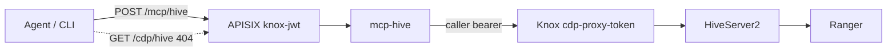
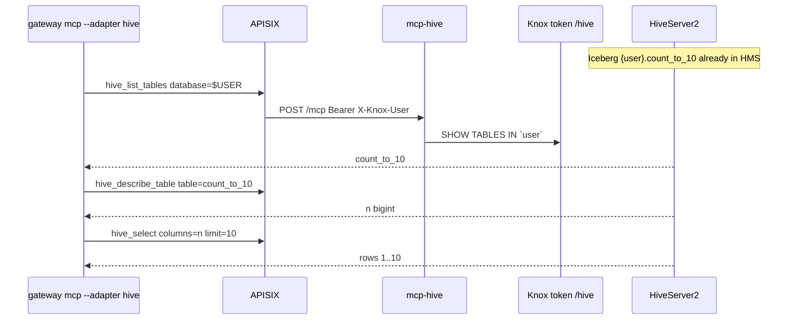
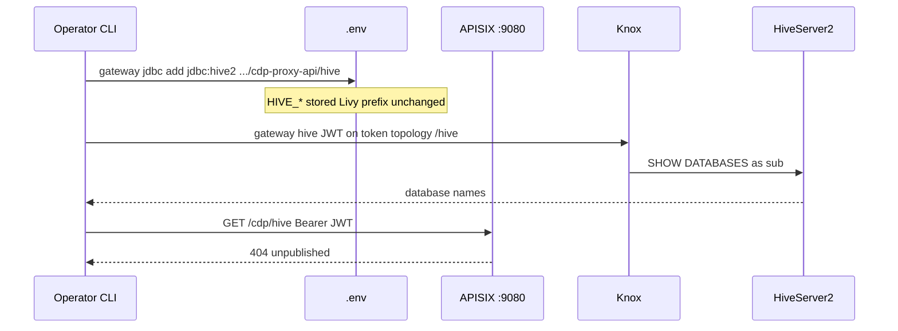

# Working with Hive

Hive has two surfaces. Agents never call HiveServer2 or Knox hostnames directly.

| Surface | URI | Who uses it |
| --- | --- | --- |
| MCP | `POST /mcp/hive` | Cursor, Claude, `gateway mcp --adapter hive` |
| Operator probe | `gateway hive` → Knox `{KNOX_PROXY_PREFIX}/hive` | Operators |
| HTTP allowlist | `GET /cdp/hive` | **404** (unpublished) |

MCP requires `Authorization: Bearer <knox-jwt>`. The adapter forwards that bearer to Knox Hive on the **token** topology. Ranger authorizes `sub`. JDBC inventory (`gateway jdbc add`) still stores `cdp-proxy-api` URLs for later ops; it does not publish `/cdp/hive`.

Live stacks use `KNOX_TOKEN` (`gateway token set`). `--mint` is `GATEWAY_MODE=local` only; against Knox JWKS it is `invalid_signature` and the CLI refuses it.



## Why Hive is separate from Spark

CDP often puts Livy and Hive on **different Knox topologies**:

| Service | Typical topology | Agent route today |
| --- | --- | --- |
| Livy for Spark 3 | `cdp-proxy-token` | `/cdp/livy_for_spark3*`, `/mcp/spark` |
| HDFS WebHDFS | `cdp-proxy-token` | `/cdp/webhdfs*` (operators; `gateway webhdfs`) |
| HiveServer2 HTTP | `cdp-proxy-api` (sometimes `cdp-proxy-token`) | `/mcp/hive` (JWT uses **token** `/hive`); `/cdp/hive` → 404 |

`gateway knox` pins the **token** topology for Livy. A `cdp-proxy-api` URL is rejected there on purpose. Hive JDBC goes through `gateway jdbc add` so it cannot overwrite the Spark upstream.

```
Spark:  gateway knox  https://knox…/<env>/cdp-proxy-token/livy_for_spark3/
Hive:   gateway jdbc add  'jdbc:hive2://knox…/;ssl=true;transportMode=http;httpPath=<env>/cdp-proxy-api/hive'
MCP:    gateway mcp --adapter hive --tool hive_list_databases
```

Both JDBC and Livy must resolve to the **same Knox host** once Spark is live. The CLI refuses a JDBC URL whose host does not match `UPSTREAM_HOST`.

## MCP tools

Lab mock (`GATEWAY_MODE=local`, `UPSTREAM_HOST=mock-cdp`) returns canned `default` / `analytics` data and uses `--mint`. Live Knox uses `KNOX_TOKEN` on `{KNOX_PROXY_PREFIX}/hive`; `--mint` is refused (`invalid_signature` against Knox JWKS).

| Tool | What it runs | Caps |
| --- | --- | --- |
| `hive_list_databases` | `SHOW DATABASES` | 100 names |
| `hive_list_tables` | `SHOW TABLES IN \`db\`` | identifier required |
| `hive_describe_table` | `DESCRIBE \`db\`.\`table\`` | identifier required |
| `hive_select` | `SELECT cols FROM \`db\`.\`table\` LIMIT n` | named columns only; `limit` 1–50 |

```bash
# lab
gateway mcp --adapter hive --mint
gateway mcp --adapter hive --tool hive_list_databases --mint
gateway mcp --adapter hive --tool hive_select --arg database=default --arg table=dual --arg columns=dummy_col --arg limit=5 --mint

# live (same JWT as Spark)
gateway mcp --adapter hive --tool hive_list_databases
```

After [`examples/spark/count_to_10.py`](../examples/spark/count_to_10.py) succeeds, query that Iceberg table with the same Knox JWT. Hive still cannot CREATE or INSERT. Walkthrough: [examples/hive/README.md](../examples/hive/README.md).



```bash
gateway mcp --adapter hive --tool hive_list_tables --arg database=$USER
gateway mcp --adapter hive --tool hive_describe_table \
  --arg database=$USER --arg table=count_to_10
gateway mcp --adapter hive --tool hive_select \
  --arg database=$USER --arg table=count_to_10 --arg columns=n --arg limit=10
```

A successful `hive_select` looks like `kind=select`, `columns=["n"]`, `returned=10`, `rows` `{"n":"1"}` … `{"n":"10"}`. Named columns are required; `SELECT *` is rejected. If Hive has not seen the table yet, the tool error names `count_to_10` (HTTP 200 JSON-RPC `isError`, not a raw 500).

Must not:

- run DDL/DML or free-form SQL
- accept `SELECT *` or a `WHERE` clause
- accept JDBC passwords from the agent
- impersonate a different Hive user than the Knox `sub`
- dump unbounded result sets into an LLM context

A valid Knox JWT plus `/cdp/hive` still returns **404**. That is a test case (P1-06), not a bug.

`401` `invalid_signature` on `/mcp/hive` means the bearer was not signed by the PEM APISIX is verifying. On live Knox that is usually `--mint` or a JWT from a different cluster. Drop `--mint` and use `gateway token set`.

## Inventory a JDBC URL


Copy the JDBC string from Hue, Data Warehouse, or a working Beeline session. It must use HTTP transport through Knox:

- `transportMode=http`
- `httpPath` includes a known topology (`cdp-proxy-api` or `cdp-proxy-token`) and ends with `/hive`
- `ssl=true` on HTTPS Knox

```bash
gateway jdbc add 'jdbc:hive2://knox.example.cloudera.site/;ssl=true;transportMode=http;httpPath=env/cdp-proxy-api/hive'
gateway jdbc show
```

`gateway jdbc show` redacts `password` / `passwd`. Prefer a Knox JWT later rather than embedding a password in JDBC.

That writes `.env` keys (never commit them):

| Key | Meaning |
| --- | --- |
| `HIVE_JDBC_URL` | Original JDBC (password redacted on print) |
| `HIVE_KNOX_URL` | `https://host[:port]/<prefix>/hive` |
| `HIVE_KNOX_PREFIX` | Path through topology, e.g. `/env/cdp-proxy-api` |
| `HIVE_KNOX_TOPOLOGY` | `cdp-proxy-api` or `cdp-proxy-token` |
| `HIVE_KNOX_SERVICE` | `/hive` |

`gateway jdbc clear` drops those keys. It does not change Livy settings.

Private Cloud paths often look like `/gateway/cdp-proxy-api/hive`. Public Cloud often uses `/<env>/cdp-proxy-api/hive`.

## Operator probe: list databases

A Knox JWT (`aud=cdp-proxy-token`) authenticates Hive on the **token** topology, not `cdp-proxy-api`. `cdp-proxy-api/hive` returns `401` for that token.

```bash
gateway hive              # SHOW DATABASES
gateway hive databases    # same
```

This calls Knox `{KNOX_PROXY_PREFIX}/hive` with `KNOX_TOKEN`. It is not an agent route and does not add `/cdp/hive`. Needs `impyla` (`pip install 'impyla>=0.19'` or `pip install -e ".[hive]"`).



## What is not enabled

- No APISIX route for `/cdp/hive` (MCP is `/mcp/hive`; operator `gateway hive` talks to Knox directly)
- No Beeline/JDBC from agents
- No free-form SQL, `WHERE`, or `SELECT *`
- Binary Hive (`transportMode` not `http`) cannot be proxied

## Operator checklist

1. Spark live path works (`gateway spark` / `gateway mcp`) — [spark.md](spark.md)
2. Paste Hive JDBC with `gateway jdbc add`
3. Confirm `gateway jdbc show` topology and host
4. `gateway hive` lists databases for the Knox `sub` (token topology)
5. `gateway mcp --adapter hive --tool hive_list_databases` as the same `sub` (omit `--mint` on live Knox)
6. Confirm Ranger policies for that `sub` on the Hive database
7. `gateway mcp --adapter hive --tool hive_select` on `{user}.count_to_10` column `n` after Spark succeeds — [examples/hive/README.md](../examples/hive/README.md)
8. Keep `/cdp/hive` unpublished
