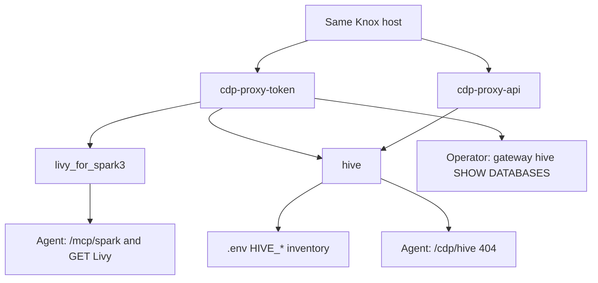
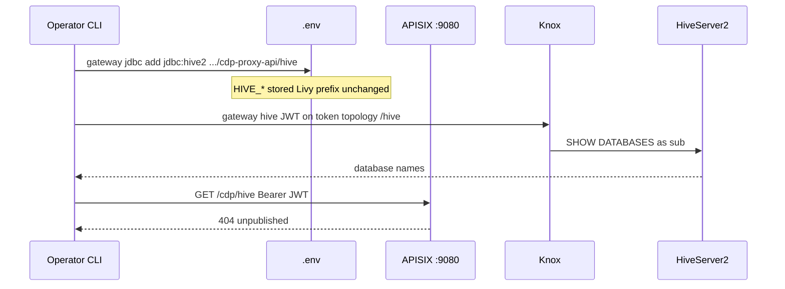
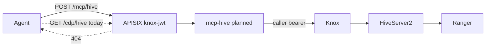

# Working with Hive

Hive is **inventoried**, not published. Agents cannot call HiveServer2, Beeline, or `/cdp/hive` through this gateway today. Spark remains the only CDP service on the allowlist ([spark.md](spark.md)).

This page is how operators store a Knox Hive JDBC URL so a future `mcp-hive` adapter can use the same cluster without guessing topologies.

## Why Hive is separate from Spark

CDP often puts Livy and Hive on **different Knox topologies**:

| Service | Typical topology | Agent route today |
| --- | --- | --- |
| Livy for Spark 3 | `cdp-proxy-token` | `/cdp/livy_for_spark3*`, `/mcp/spark` |
| HiveServer2 HTTP | `cdp-proxy-api` (sometimes `cdp-proxy-token`) | **none** (`/cdp/hive` → 404) |

`gateway knox` pins the **token** topology for Livy. A `cdp-proxy-api` URL is rejected there on purpose. Hive JDBC goes through `gateway jdbc add` so it cannot overwrite the Spark upstream.



```
Spark:  gateway knox  https://knox…/<env>/cdp-proxy-token/livy_for_spark3/
Hive:   gateway jdbc add  'jdbc:hive2://knox…/;ssl=true;transportMode=http;httpPath=<env>/cdp-proxy-api/hive'
```

Both must resolve to the **same Knox host** once Spark is live. The CLI refuses a JDBC URL whose host does not match `UPSTREAM_HOST`.

## Inventory a JDBC URL

Copy the JDBC string from Hue, Data Warehouse, or a working Beeline session. It must use HTTP transport through Knox:

- `transportMode=http`
- `httpPath` includes a known topology (`cdp-proxy-api` or `cdp-proxy-token`) and ends with `/hive`
- `ssl=true` on HTTPS Knox

```bash
gateway jdbc add 'jdbc:hive2://knox.example.cloudera.site/;ssl=true;transportMode=http;httpPath=env/cdp-proxy-api/hive'
gateway jdbc show
```

`gateway jdbc show` redacts `password` / `passwd`. Prefer a Knox JWT later rather than embedding a password in JDBC.

That writes `.env` keys (never commit them):

| Key | Meaning |
| --- | --- |
| `HIVE_JDBC_URL` | Original JDBC (password redacted on print) |
| `HIVE_KNOX_URL` | `https://host[:port]/<prefix>/hive` |
| `HIVE_KNOX_PREFIX` | Path through topology, e.g. `/env/cdp-proxy-api` |
| `HIVE_KNOX_TOPOLOGY` | `cdp-proxy-api` or `cdp-proxy-token` |
| `HIVE_KNOX_SERVICE` | `/hive` |

`gateway jdbc clear` drops those keys. It does not change Livy settings.

Private Cloud paths often look like `/gateway/cdp-proxy-api/hive`. Public Cloud often uses `/<env>/cdp-proxy-api/hive`.

## Operator probe: list databases

A Knox JWT (`aud=cdp-proxy-token`) authenticates Hive on the **token** topology, not `cdp-proxy-api`. `cdp-proxy-api/hive` returns `401` for that token.

```bash
gateway hive              # SHOW DATABASES
gateway hive databases    # same
```

This calls Knox `{KNOX_PROXY_PREFIX}/hive` with `KNOX_TOKEN`. It is not an agent route and does not add `/cdp/hive`. Needs `impyla` (`pip install 'impyla>=0.19'` or `pip install -e ".[hive]"`).



## What is not enabled

- No APISIX route for `/cdp/hive` (operator `gateway hive` talks to Knox directly)
- No `/mcp/hive` adapter (`mcp-hive` is a later slice)
- No Beeline/JDBC from agents
- Binary Hive (`transportMode` not `http`) cannot be proxied

A valid Knox JWT plus `/cdp/hive` still returns **404**. That is a test case (P1-06), not a bug.

## Planned `mcp-hive` (not implemented)

When it lands, it should look like Spark: APISIX `knox-jwt` on `/mcp/hive`, adapter uses the caller bearer against `{HIVE_KNOX_URL}`, Ranger authorizes `sub`.



Expected first tools (read-only):

- list databases / tables (capped)
- describe table
- `SELECT` with a hard row limit — never `SELECT *` unbounded

Must not:

- run DDL/DML
- accept JDBC passwords from the agent
- impersonate a different Hive user than the Knox `sub`
- dump wide result sets into an LLM context

## Operator checklist

1. Spark live path works (`gateway spark` / `gateway mcp`) — [spark.md](spark.md)
2. Paste Hive JDBC with `gateway jdbc add`
3. Confirm `gateway jdbc show` topology and host
4. `gateway hive` lists databases for the Knox `sub` (token topology)
5. Confirm Ranger policies for the same `sub` on the Hive database you will allow later
6. Leave `/cdp/hive` unpublished until `mcp-hive` exists and has tests in [testing.md](testing.md)
