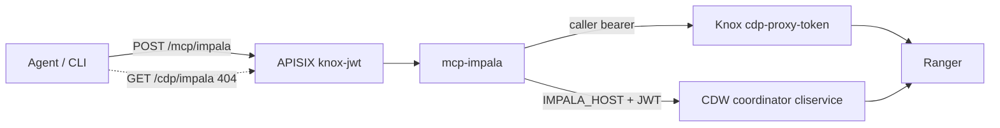

# Working with Impala

Impala has two surfaces. Agents never call Impala daemons or Knox hostnames directly.

| Surface | URI | Who uses it |
| --- | --- | --- |
| MCP | `POST /mcp/impala` | Cursor, Claude, `gateway mcp --adapter impala` |
| Operator probe | `gateway impala` → CDW `cliservice` or Knox `{KNOX_PROXY_PREFIX}/impala` | Operators |
| HTTP allowlist | `GET /cdp/impala` | **404** (unpublished) |

MCP requires `Authorization: Bearer <knox-jwt>` and, on Compose, `X-Agent-Key`. The adapter forwards that bearer as **AuthMech=12 (JWT)**. Ranger authorizes `sub`. `/cdp/impala` is not an agent route.

Public Cloud **CDW Impala Virtual Warehouses** use a coordinator host (`jdbc:impala://…;httpPath=cliservice`), not Knox `{prefix}/impala`. Inventory that JDBC with `gateway jdbc add`. It does **not** change Livy `UPSTREAM_HOST`. JDBC `auth=browser` is workstation SSO; agents already send the Knox JWT.

Without `IMPALA_HOST`, the adapter falls back to Knox `{KNOX_PROXY_PREFIX}/impala`.

Live stacks use `KNOX_TOKEN` (`gateway token set`). `--mint` is `GATEWAY_MODE=local` only.



## Inventory a CDW JDBC URL

```
Spark:   gateway knox  https://knox…/<env>/cdp-proxy-token/livy_for_spark3/
Hive:    gateway jdbc add  'jdbc:hive2://knox…/;ssl=true;transportMode=http;httpPath=<env>/cdp-proxy-api/hive'
Impala:  gateway jdbc add  'jdbc:impala://coordinator…:443/default;AuthMech=12;transportMode=http;httpPath=cliservice;ssl=1;auth=browser'
```

`/default` after the host is the default database name, not an HTTP path. `httpPath=cliservice` is the HS2 endpoint. Recreate `mcp-impala` after adding JDBC so Compose picks up `IMPALA_HOST`.

```bash
gateway jdbc add 'jdbc:impala://coordinator.example:443/default;AuthMech=12;transportMode=http;httpPath=cliservice;ssl=1;auth=browser'
gateway jdbc show
gateway up   # or: docker compose up -d --force-recreate mcp-impala
```

`gateway jdbc show` redacts `password` / `passwd`. `gateway jdbc clear --adapter impala` drops `IMPALA_*` without touching Hive or Livy.

## Why Impala is separate from Hive

Hive and Impala often share HMS tables but are **different services** (Knox `/hive` vs `/impala`, or a CDW coordinator) with separate Ranger policies. Spark Iceberg writes that Hive can select may still 404 in Impala until an operator refreshes metadata outside this gateway. This adapter does **not** run `INVALIDATE METADATA` or `REFRESH`.

## MCP tools

Lab mock (`GATEWAY_MODE=local`, empty `IMPALA_HOST`, `UPSTREAM_HOST=mock-cdp`) returns canned `default` / `analytics` data and uses `--mint`. Live uses `KNOX_TOKEN` against `IMPALA_HOST` or Knox `/impala`.

| Tool | What it runs | Caps |
| --- | --- | --- |
| `impala_list_databases` | `SHOW DATABASES` | 100 names |
| `impala_list_tables` | `SHOW TABLES IN \`db\`` | identifier required |
| `impala_describe_table` | `DESCRIBE \`db\`.\`table\`` | identifier required |
| `impala_select` | `SELECT cols FROM \`db\`.\`table\` LIMIT n` | named columns only; `limit` 1–50 |

```bash
# lab
gateway mcp --adapter impala --mint
gateway mcp --adapter impala --tool impala_list_databases --mint
gateway mcp --adapter impala --tool impala_select --arg database=default --arg table=dual --arg columns=dummy_col --arg limit=5 --mint

# live (same JWT as Spark)
gateway mcp --adapter impala --tool impala_list_databases
```

After [`examples/spark/count_to_10.py`](../examples/spark/count_to_10.py) succeeds, try the same Iceberg table. Walkthrough: [examples/impala/README.md](../examples/impala/README.md).

```bash
gateway mcp --adapter impala --tool impala_list_tables --arg database=$USER
gateway mcp --adapter impala --tool impala_describe_table \
  --arg database=$USER --arg table=count_to_10
gateway mcp --adapter impala --tool impala_select \
  --arg database=$USER --arg table=count_to_10 --arg columns=n --arg limit=10
```

Must not:

- run DDL/DML, `INVALIDATE METADATA`, `REFRESH`, or free-form SQL
- accept `SELECT *` or a `WHERE` clause
- impersonate a different Impala user than the Knox `sub`
- dump unbounded result sets into an LLM context
- implement JDBC `auth=browser` (agents send the Knox JWT)

A valid Knox JWT plus `/cdp/impala` still returns **404**.

## Errors

APISIX `401` (HTTP, JSON `{"error":"unauthorized"}`) is **not** the same as an Impala tool error. MCP still returns HTTP 200 JSON-RPC with `isError` when HS2 fails after the gateway accepted the JWT.

| What you see | Where it failed | What to do |
| --- | --- | --- |
| HTTP `401` `invalid_signature` | APISIX `knox-jwt` | Lab `--mint` against live Knox JWKS. Drop `--mint`; `gateway token set`. |
| HTTP `401` `missing_token` / missing `X-Agent-Key` | APISIX | Send `Authorization: Bearer` and Compose `X-Agent-Key`. |
| JSON-RPC `isError`, `status` 401, message has `HTTP code 401` | CDW `cliservice` (or Knox `/impala`) rejected the JWT | APISIX already accepted it. JDBC `auth=browser` is not used. The warehouse must trust that Knox JWT (`AuthMech=12`). |
| JSON-RPC `isError`, `status` 403 | Ranger / Impala privileges | Grant the Knox `sub` on that database/table. |
| JSON-RPC `isError`, `status` 404 | Unknown database/table/column, or HMS not visible to Impala | Wait for metadata; this adapter does not `INVALIDATE METADATA`. Hive MCP may still work. |
| JSON-RPC `isError`, `status` 502, `Impala HS2 rejected the request` | HS2/impyla transport (no stack leaked) | Check `IMPALA_HOST` / TLS; recreate `mcp-impala` after `gateway jdbc add`. |

The adapter never returns the raw bearer in a tool error.

## Operator probe: list databases

```bash
gateway impala              # SHOW DATABASES
gateway impala databases    # same
```

This uses `KNOX_TOKEN` against inventoried `IMPALA_HOST` (`cliservice`) or Knox `{KNOX_PROXY_PREFIX}/impala`. It is not an agent route and does not add `/cdp/impala`. Needs `impyla` (`pip install 'impyla>=0.19'` or `pip install -e ".[hive]"`).

## What is not enabled

- No APISIX route for `/cdp/impala` (MCP is `/mcp/impala`; operator `gateway impala` talks to CDW or Knox directly)
- No JDBC/Beeline from agents; no browser SSO in the adapter
- No free-form SQL, `WHERE`, or `SELECT *`

## Operator checklist

1. Spark live path works (`gateway spark` / `gateway mcp`) — [spark.md](spark.md)
2. `gateway jdbc add` with the CDW `jdbc:impala://` URL (or confirm Knox `/impala` is the hop)
3. `gateway impala` lists databases for the Knox `sub`
4. `gateway mcp --adapter impala --tool impala_list_databases` as the same `sub` (omit `--mint` on live Knox)
5. If that call is JSON-RPC `status` 401 with `HTTP code 401`, the VW rejected the JWT — see [Errors](#errors)
6. Confirm Ranger Impala policies for that `sub` (CDW VW or Knox Impala)
7. Optional: `impala_select` on `{user}.count_to_10` after Spark succeeds — [examples/impala/README.md](../examples/impala/README.md)
8. Keep `/cdp/impala` unpublished
