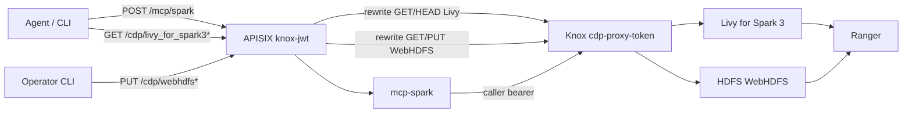
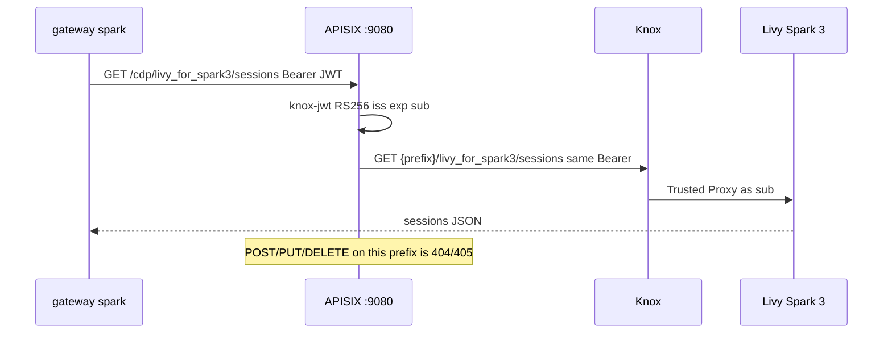
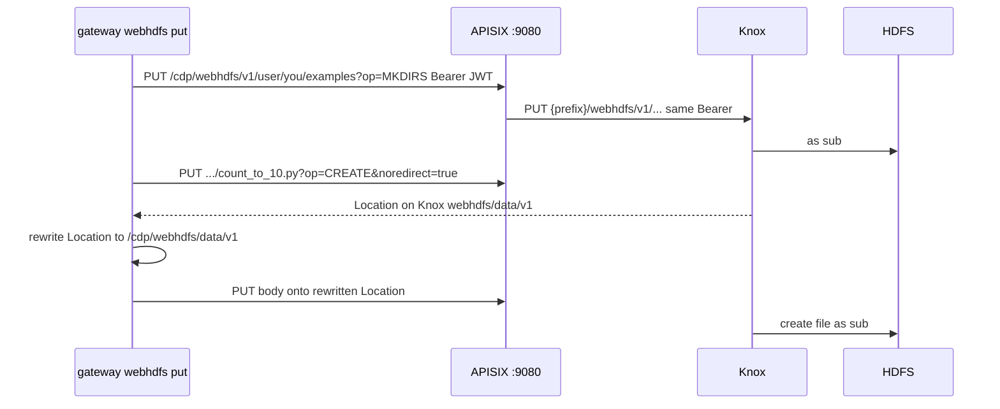
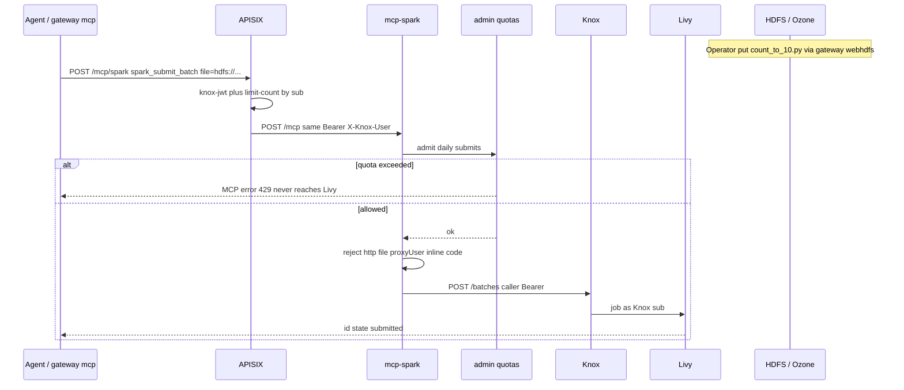

# Working with Spark

Agents reach Spark only through this gateway. They never call Livy or Knox hostnames directly.

Two surfaces share the same Knox JWT and the same Ranger subject. Operators also stage job files through WebHDFS on this gateway (not a laptop `hdfs dfs` client):

| Surface | URI | Methods | Who uses it |
| --- | --- | --- | --- |
| Livy HTTP | `/cdp/livy_for_spark3*` | GET, HEAD | Operators (`gateway spark`), tests |
| WebHDFS | `/cdp/webhdfs*` | GET, HEAD, PUT | Operators (`gateway webhdfs`) to put `file` URIs |
| MCP | `/mcp/spark` | POST (JSON-RPC) | Cursor, Claude, `gateway mcp` |

Both require `Authorization: Bearer <knox-jwt>`. Compose: APISIX `knox-jwt` validates the token, then either rewrites to Knox Livy or WebHDFS, or forwards to the `mcp-spark` adapter. AMP: the CML `mcp-spark` application validates the same JWT in Python (no WebHDFS route). `/cdp/hive` stays **404**; Hive MCP is `/mcp/hive` ([hive.md](hive.md)).



## Lab

```bash
gateway init
gateway up
gateway spark --mint
gateway webhdfs ls --mint /
gateway mcp --mint
gateway mcp --adapter hive --mint
```

Mock Livy and Hive live in `mock-cdp`. `gateway spark --mint` signs a local RS256 JWT. No CDP entitlement is required. `--mint` is `GATEWAY_MODE=local` only; live Knox JWKS rejects those signatures.

## Live cluster

```bash
gateway knox https://knox.example.com/<env>/cdp-proxy-token/livy_for_spark3/
gateway fetch-jwks --insecure
gateway token set
gateway up
gateway spark
gateway webhdfs ls /
gateway mcp
```

`gateway knox` must see topology `cdp-proxy-token` and service `livy_for_spark3`. A `cdp-proxy-api` URL is rejected; that topology is for [Hive JDBC inventory](hive.md).

The Knox subject (`sub`) must be allowed by Ranger to use Livy / the Spark queue. The gateway does not impersonate (`proxyUser` is rejected on submit).

## Livy HTTP

`gateway spark [resource]` is `GET /cdp/livy_for_spark3/<resource>` (default `sessions`).

```bash
gateway spark                 # GET .../sessions
gateway spark batches         # GET .../batches
gateway spark batches/0       # GET .../batches/0
```

Rewrite: `/cdp/(.*)` → `{KNOX_PROXY_PREFIX}/$1`. Example:

`GET http://127.0.0.1:9080/cdp/livy_for_spark3/sessions`  
→ `GET https://knox…/<prefix>/cdp-proxy-token/livy_for_spark3/sessions`



Prefer MCP for agents. Raw Livy on the agent listener is **GET/HEAD only**. `POST`/`PUT`/`DELETE` (including `.../sessions/{id}/statements` and `POST .../batches`) return 404 or 405. Submit a cluster file URI with `spark_submit_batch`.

## WebHDFS (operator staging)

Livy cannot read a laptop path. Put the job on HDFS through this gateway, then submit that URI. Native `hdfs dfs` needs a Hadoop client, Kerberos, and datanode IPs; WebHDFS uses the same Knox JWT as Spark.

Rewrite: `/cdp/webhdfs/...` → `{KNOX_PROXY_PREFIX}/webhdfs/...`. That covers both `/webhdfs/v1` and Knox's `/webhdfs/data/v1` CREATE follow-up. `DELETE` is not a route.

```bash
gateway webhdfs mkdir /user/$USER/examples
gateway webhdfs put examples/spark/count_to_10.py /user/$USER/examples/count_to_10.py
gateway webhdfs stat /user/$USER/examples/count_to_10.py
gateway webhdfs ls /user/$USER/examples
```

`gateway webhdfs put` calls `MKDIRS` on the parent, `CREATE` with `noredirect=true`, then `PUT`s the body to the Location **only after** rewriting it onto `http://127.0.0.1:9080/cdp/webhdfs/...`. A Location host other than the pinned Knox host is refused.



Agents should not call `/cdp/webhdfs`. MCP hosts submit an `hdfs://` URI that is already on the cluster.

## MCP tools

`mcp-spark` is a Compose upstream (APISIX strips `/mcp/spark` to `/mcp`) and the same module behind the optional CML AMP application. Tools forward the **caller** bearer; they hold no cluster secrets.

| Tool | Livy call | Notes |
| --- | --- | --- |
| `spark_list_sessions` | `GET /sessions` | Lists truncated to 25 |
| `spark_list_batches` | `GET /batches` | Same cap |
| `spark_get_batch` | `GET /batches/{id}` | `id`, `state`, `appId`, owner only |
| `spark_get_log` | `GET /batches/{id}/log` | Last 80 lines, 8k chars |
| `spark_submit_batch` | `POST /batches` | **Write** as Knox `sub`. HDFS/object-store `file` only |

```bash
gateway mcp
gateway mcp --tool spark_list_batches
gateway mcp --tool spark_get_batch --arg batch_id=0
gateway mcp --tool spark_get_log --arg batch_id=0
```

### Submit (write)

This tool runs Spark **as the Knox token subject**. Ranger still decides whether that user may use the queue. Copy a job to a URI Ranger allows, then submit that URI. Livy cannot read a laptop path.



Allowed `file` schemes: `hdfs`, `viewfs`, `s3a`, `s3`, `abfs`, `abfss`, `o3fs`, `ofs`. Rejected: `http`, `file` (unless `SPARK_ALLOW_FILE_SCHEME=true` for a closed lab), `..` in the path, inline `code`, `proxyUser`.

Sample job: [`examples/spark/count_to_10.py`](../examples/spark/count_to_10.py). It prints `n=1` … `n=10`, then `CREATE OR REPLACE`s Iceberg table `{user}.count_to_10` (column `n`) in the Hive catalog so [Hive MCP](hive.md) can `hive_select` it. Database/table default to the Spark user and `count_to_10`. Omit Livy `args` unless this cluster accepts them.

```bash
gateway webhdfs put examples/spark/count_to_10.py /user/$USER/examples/count_to_10.py

gateway mcp --tool spark_submit_batch \
  --arg file=hdfs:///user/$USER/examples/count_to_10.py \
  --arg name=count-to-10
```

Poll with `spark_get_batch` until `state` is `success` or `dead`. Then query Hive (same JWT): [hive.md](hive.md), [examples/hive/README.md](../examples/hive/README.md).

```bash
gateway mcp --adapter hive --tool hive_list_tables --arg database=$USER
gateway mcp --adapter hive --tool hive_describe_table \
  --arg database=$USER --arg table=count_to_10
gateway mcp --adapter hive --tool hive_select \
  --arg database=$USER --arg table=count_to_10 --arg columns=n --arg limit=10
```

Do not expose interactive Livy `POST /sessions/{id}/statements` (run code). That is how prompt injection becomes a cluster shell. APISIX does not match that method on `/cdp/livy_for_spark3*`; mcp-spark has no statements tool.

## MCP host config

Put the Knox JWT in the host secret store, never in git.

```json
{
  "mcpServers": {
    "cdp-spark": {
      "url": "http://127.0.0.1:9080/mcp/spark",
      "headers": {
        "Authorization": "Bearer <knox-jwt>"
      }
    },
    "cdp-hive": {
      "url": "http://127.0.0.1:9080/mcp/hive",
      "headers": {
        "Authorization": "Bearer <knox-jwt>"
      }
    }
  }
}
```

Agents should call `/mcp/spark` or `/mcp/hive` only, with **POST JSON-RPC**. Streamable HTTP (GET SSE, MCP session) is **not** implemented and is held. Do not teach them the Knox URL, `/cdp/webhdfs`, `/cdp/hive`, or the operator admin UI (`:9090`). AMP hosts use `https://mcp-spark.<workspace>/mcp/spark` or `https://mcp-hive.<workspace>/mcp/hive` instead of localhost; see [amp.md](amp.md).

Operators set per-user daily call/submit quotas in [admin.md](admin.md). A denied submit is an MCP tool error and does not reach Livy. Operators look up a call by APISIX `X-Request-Id` (`GET /api/audit`) to join tool, `sub`, and `knox.id`.

APISIX also applies a per-`sub` burst cap on `/mcp/spark` and `/mcp/hive` (`MCP_RATE_COUNT` / `MCP_RATE_WINDOW` in `.env`, default 60 per 60s). Exceeding it is HTTP `429` (`mcp rate limit`). Livy GET and WebHDFS are not capped this way. The AMP profile enforces the same counters in Python.

## What Spark does not do

- No Hive SQL through Spark tools (see [hive.md](hive.md) for `/mcp/hive`)
- No Streamable HTTP (GET SSE / MCP session); hosts POST JSON-RPC to `/mcp/spark`
- No catch-all `/cdp/*`
- No raw Livy writes on `/cdp/livy_for_spark3*` (GET/HEAD only)
- No WebHDFS `DELETE` (GET/HEAD/PUT only)
- No gateway-held keytab or impersonation
- No full executor log dump into an LLM context
