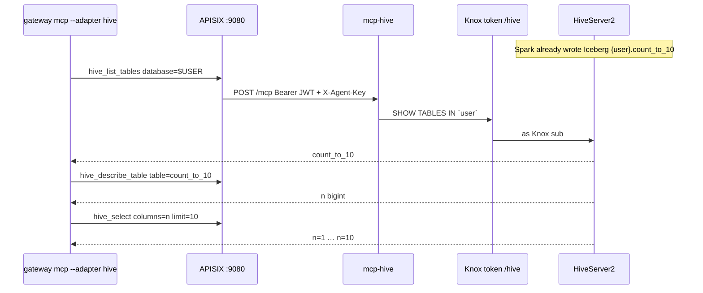

# Hive examples

Hive MCP is **read-only**. Spark writes the Iceberg table ([`../spark/count_to_10.py`](../spark/count_to_10.py)); these tools query it as the Knox token subject. Named columns only, `limit` ≤ 50. No `SELECT *`, `WHERE`, or DDL.

Operator guide: [docs/hive.md](../../docs/hive.md).



## After Spark succeeds

Same Knox JWT as the Spark submit (`KNOX_TOKEN` / `gateway token set`). Do not pass `--mint` on a live stack. Database defaults to the Spark user (`$USER` / Knox `sub`). Table is `count_to_10`, column `n`.

```bash
source .venv/bin/activate

gateway mcp --adapter hive --tool hive_list_databases
gateway mcp --adapter hive --tool hive_list_tables --arg database=$USER
gateway mcp --adapter hive --tool hive_describe_table \
  --arg database=$USER --arg table=count_to_10
gateway mcp --adapter hive --tool hive_select \
  --arg database=$USER --arg table=count_to_10 --arg columns=n --arg limit=10
```

`hive_select` is `SELECT \`n\` FROM \`$USER\`.\`count_to_10\` LIMIT 10` (identifiers only; the adapter builds the SQL). Expected payload (truncated; `database` is the Knox `sub`):

```json
{
  "kind": "select",
  "database": "<knox-sub>",
  "table": "count_to_10",
  "columns": ["n"],
  "returned": 10,
  "limit": 10,
  "truncated": false,
  "rows": [
    {"n": "1"},
    {"n": "2"},
    {"n": "3"},
    {"n": "4"},
    {"n": "5"},
    {"n": "6"},
    {"n": "7"},
    {"n": "8"},
    {"n": "9"},
    {"n": "10"}
  ]
}
```

`hive_describe_table` should show `n` / `bigint` before you select.

If `hive_list_tables` does not list `count_to_10`, wait for `spark_get_batch` `state=success` and retry. Hive MCP returns a tool error when the table is missing; it does not run CREATE TABLE.

## Lab mock

`--mint` only works after `gateway knox --local` (APISIX verifies `conf/keys/public.pem`). On a live stack it is refused: lab tokens cannot satisfy Knox JWKS (`invalid_signature`). No Iceberg in mock; canned `default.dual`:

```bash
gateway knox --local
gateway up
gateway mcp --adapter hive --mint
gateway mcp --adapter hive --tool hive_select --mint \
  --arg database=default --arg table=dual --arg columns=dummy_col --arg limit=5
```

## What Hive MCP does not do

- Free-form SQL, `WHERE`, `SELECT *`
- DDL/DML (Spark owns the write)
- `/cdp/hive` (stays 404)
- Beeline/JDBC from agents
