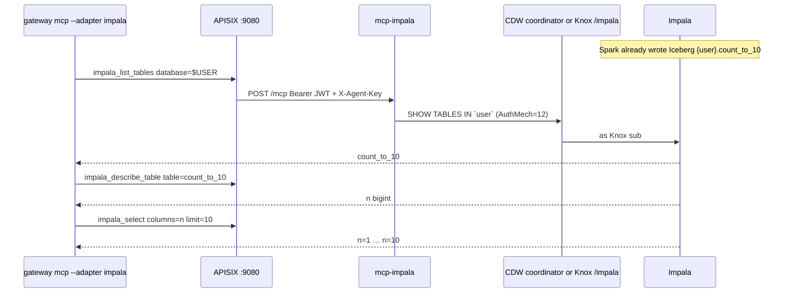

# Impala examples

Impala MCP is **read-only**. Spark writes the Iceberg table ([`../spark/count_to_10.py`](../spark/count_to_10.py)); these tools query it as the Knox token subject when Impala has refreshed HMS metadata. Named columns only, `limit` ≤ 50. No `SELECT *`, `WHERE`, or DDL.

Operator guide: [docs/impala.md](../../docs/impala.md).



Inventory a CDW JDBC URL (does not change Livy `UPSTREAM_HOST`):

```bash
gateway jdbc add 'jdbc:impala://coordinator.example:443/default;AuthMech=12;transportMode=http;httpPath=cliservice;ssl=1;auth=browser'
```

JDBC `auth=browser` is workstation SSO. Agents send the same Knox JWT as Spark (`AuthMech=12`).

## After Spark succeeds

Same Knox JWT as the Spark submit (`KNOX_TOKEN` / `gateway token set`). Do not pass `--mint` on a live stack. Database defaults to the Spark user (`$USER` / Knox `sub`). Table is `count_to_10`, column `n`.

If Impala has not seen the table yet, the tool error names `count_to_10`. Hive MCP may still work; this adapter does not run `INVALIDATE METADATA`.

HTTP `401 invalid_signature` is APISIX (usually `--mint` on live Knox). A JSON-RPC tool error with `status` 401 and `HTTP code 401` means the CDW coordinator rejected the JWT after APISIX accepted it. Details: [docs/impala.md](../../docs/impala.md#errors).

```bash
source .venv/bin/activate

gateway mcp --adapter impala --tool impala_list_databases
gateway mcp --adapter impala --tool impala_list_tables --arg database=$USER
gateway mcp --adapter impala --tool impala_describe_table \
  --arg database=$USER --arg table=count_to_10
gateway mcp --adapter impala --tool impala_select \
  --arg database=$USER --arg table=count_to_10 --arg columns=n --arg limit=10
```

## Lab mock

`--mint` only works after `gateway knox --local`. Canned `default.dual`:

```bash
gateway knox --local
gateway up
gateway mcp --adapter impala --mint
gateway mcp --adapter impala --tool impala_select --mint \
  --arg database=default --arg table=dual --arg columns=dummy_col --arg limit=5
```

## What Impala MCP does not do

- Free-form SQL, `WHERE`, `SELECT *`
- DDL/DML / `INVALIDATE METADATA` / `REFRESH`
- `/cdp/impala` (stays 404)
- JDBC from agents
