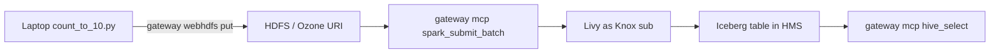

# Spark examples

`count_to_10.py` is a Livy / CDE Spark 3 batch that prints `n=1` … `n=10`, then writes those rows to an **Iceberg** table in the Hive catalog. Hive MCP can `hive_select` that table afterward (named columns, `limit` ≤ 50). Spark is the write; Hive tools stay read-only.

Operator guide: [docs/spark.md](../../docs/spark.md), then [docs/hive.md](../../docs/hive.md). `spark_submit_batch` is a write as the Knox token subject. Livy cannot read this file from your laptop. Copy it to a URI Ranger allows, then submit through the gateway.



```bash
# example: HDFS through the gateway (adjust user)
gateway webhdfs put examples/spark/count_to_10.py /user/$USER/examples/count_to_10.py

source .venv/bin/activate
gateway mcp --tool spark_submit_batch \
  --arg file=hdfs:///user/$USER/examples/count_to_10.py \
  --arg name=count-to-10
```

Do not pass `--arg args=…` unless Livy on this cluster accepts batch `args` (this environment returned HTTP 400 when they were set). Defaults: Spark user as database, table `count_to_10`. Optional args, if used, are `<database> <table>`. Ranger must allow that subject to create the database/table. The cluster must already expose Iceberg on `spark_catalog` (CDE Spark 3 does).

Poll:

```bash
gateway mcp --tool spark_list_batches
gateway mcp --tool spark_get_batch --arg batch_id=0
gateway mcp --tool spark_get_log --arg batch_id=0
```

When the log shows `iceberg_table=…` (or `spark_get_batch` is `success`), Spark History lists `count-to-10` as the Knox subject:


Then query Hive: [examples/hive/README.md](../hive/README.md). The same Spark → Hive path as a third-party MCP host (and as **LangGraph**) is [examples/agent/](../agent/README.md).

```bash
gateway mcp --adapter hive --tool hive_list_tables --arg database=$USER
gateway mcp --adapter hive --tool hive_describe_table \
  --arg database=$USER --arg table=count_to_10
gateway mcp --adapter hive --tool hive_select \
  --arg database=$USER --arg table=count_to_10 --arg columns=n --arg limit=10
```

Expected: `n` = 1 … 10. Named columns only; `limit` ≤ 50.

Use `s3a://`, `abfs://`, or `o3fs://` if that is where the file lives. `http://` and laptop paths are rejected.
